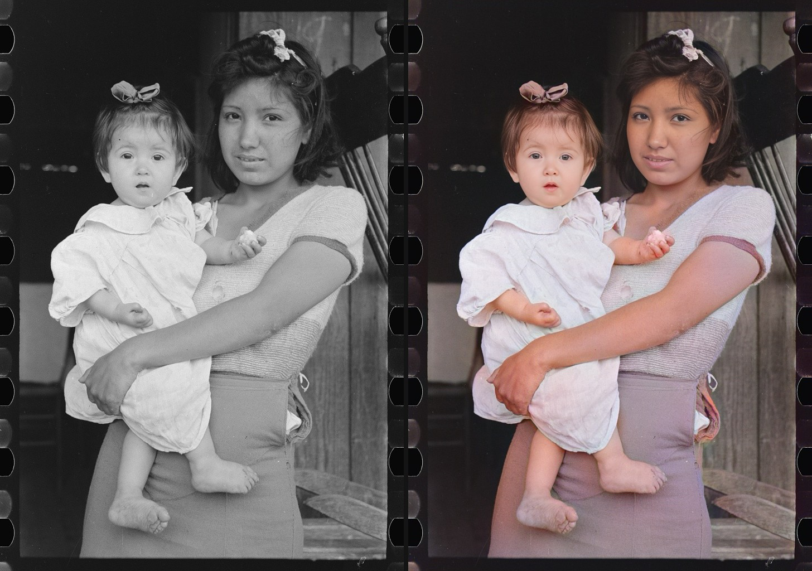
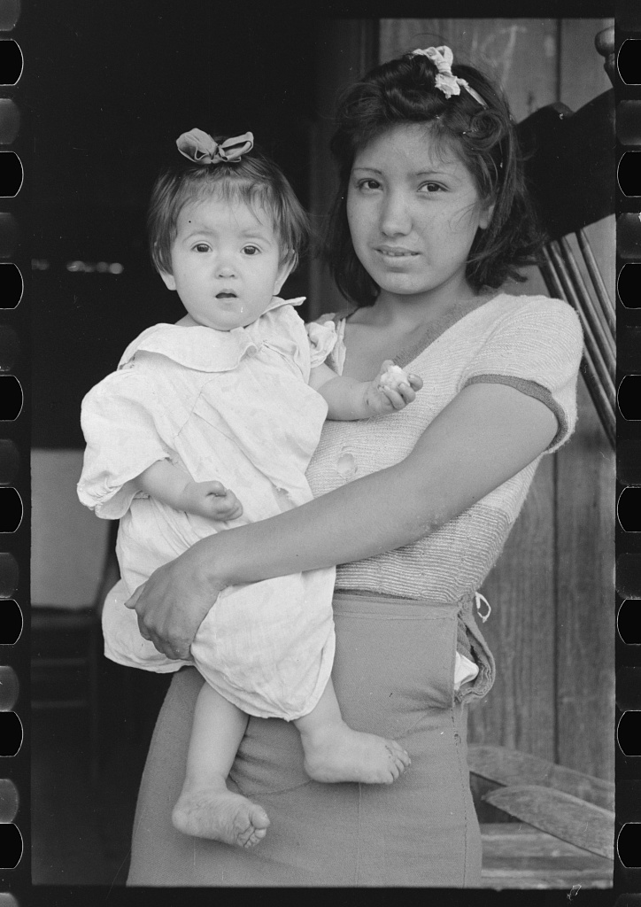
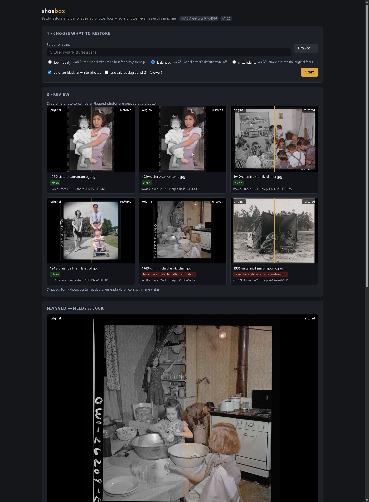

# shoebox

Free, local, batch photo-archive restorer for Windows PCs with an NVIDIA GPU.
Point it at a folder of scanned family photos; it writes a restored copy of
each (your originals are never modified), shows a before/after review gallery
in your browser, queues the photos it is unsure about, exports a clean set,
and can push the results to your own Immich server.

| Before | After |
| --- | --- |
|  | Russell Lee, San Antonio 1939 — colorized with DeOldify, faces restored with CodeFormer |





## The problem

Photo-restoration apps either run in the cloud (upload your family photos,
hit a per-day limit, pay a subscription) or are research code that needs a
Python environment and a command line. The free desktop options don't do the
whole job. shoebox is a desktop batch tool: one click to start, an overnight
run over hundreds of scans, and a gallery waiting for you in the morning. No
account, no upload, no limits.

## Requirements

- Windows 10/11 with an NVIDIA GPU (4 GB+ VRAM; anything from the last decade works)
- Python 3.10 or 3.11 on PATH (python.org installer, tick "Add python.exe to PATH")
- Internet for the first run: ~900 MB of model weights are downloaded once
- Without a GPU it falls back to CPU with a warning — expect minutes per photo instead of seconds

## Install

Double-click `run.bat`. It creates a virtual environment, installs PyTorch
with CUDA plus the other dependencies, starts the app, and opens
http://127.0.0.1:8545 in your browser.

## Usage

1. Pick or paste the folder of scans (jpg, jpeg, png, tif, tiff, bmp, webp).
2. Choose a preset (below), whether to colorize black & white photos, and
   whether to upscale the background 2x.
3. Click **Start**. Progress shows the current stage and photo.
4. Review the gallery — drag left/right on any photo to compare.
5. Photos with a red flag are queued at the bottom; re-run them at higher
   fidelity if you like, or ignore the flag.
6. **Export** copies the restored set to the job's `export` folder, and
   **Push to Immich** uploads it to your own Immich server.

A real run (the five LOC sample photos in `examples/loc-families/`, plus a
corrupt file and a same-name collision) on an RTX 4090:

```
job 20261003-122430-d1dd59: balanced preset, colorize on
  restored: 6   flagged: 2   skipped: 1
  1936-migrant-family-nipomo.jpg   faces 4→2  sharp 961→973   flagged
  1939-sisters-san-antonio.jpg     faces 2→2  sharp 430→435   clean
  1940-chamisal-family-dinner.jpg  faces 3→3  sharp 1304→1302 clean
  1942-greenbelt-family-stroll.jpg faces 3→3  sharp 1389→1386 clean
  1943-grimm-children-kitchen.jpg  faces 2→1  sharp 596→598   flagged
  torn-photo.jpg                   skipped: unreadable or corrupt image data
```

Every restored photo gets a sidecar `.json` next to it recording what was
done: source hash, models, preset, face counts in/out, sharpness in/out,
errors, and flags.

Results land in `results/<job id>/`: `restored/` (images + sidecars),
`export/` (after you export), and `job.json` (the run record).

## Presets

The preset is CodeFormer's fidelity dial (`w`). Lower `w` lets the model
invent more detail — better for heavily damaged faces, riskier for family
likeness. Higher `w` stays closer to the original face.

| Preset | w | Colorization render size | Use for |
| --- | --- | --- | --- |
| low fidelity | 0.2 | 336 px | heavy damage; the model takes over |
| balanced | 0.5 | 512 px | the default; CodeFormer's own trade-off |
| max fidelity | 0.9 | 720 px | stay closest to the real person |

"Re-run at higher fidelity" moves a photo one step up this ladder.

## QA flags

A photo is flagged for review when:

- face restoration failed for any face — CodeFormer would normally paste the
  original face back and say nothing; shoebox flags it instead
- fewer faces are detected in the restored photo than in the original
- sharpness (Laplacian variance) dropped more than 15%
- a black & white photo was sent to colorization but came back still gray

Flags are advisory. Look at the gallery and decide.

## Immich push

Enter your server URL and API key (Immich web UI → Account settings → API
keys). shoebox creates an album named `Restored <folder name>` if needed,
uploads each restored photo, and adds it to the album. Photos that fail to
upload are kept in a retry queue in the job folder; push again later and the
queue drains first. Photos already in the album are not uploaded twice.

## Privacy

Your photos never leave your machine. The app runs on 127.0.0.1, has no
accounts and no telemetry, and the only network calls it makes are the
first-run model downloads and the Immich push you trigger yourself.

## How it works

Per photo: saturation heuristic (already-color photos skip colorization) →
DeOldify artistic colorization → CodeFormer face restoration (RetinaFace
detection, face parsing for blending) → optional RealESRGAN x2 background →
quality metrics and flags. Heavy models load per stage and unload between
stages to stay inside modest VRAM.

Weights are downloaded on first use:

- CodeFormer `codeformer.pth`, `detection_Resnet50_Final.pth`,
  `parsing_parsenet.pth`, `RealESRGAN_x2plus.pth` — the pinned v0.1.0 release
  URLs from [sczhou/CodeFormer](https://github.com/sczhou/CodeFormer)
- DeOldify `ColorizeArtistic_gen.pth` from data.deepai.org (MIT-licensed per
  the [DeOldify README](https://github.com/jantic/DeOldify))

CodeFormer's library is vendored under `app/vendor/` with a small `basicsr`
shim (the published basicsr package does not import on torchvision ≥ 0.17);
`app/vendor/PROVENANCE.md` lists every file and edit. CodeFormer's code is
S-Lab License 1.0 (non-commercial use) — fine for this tool, but read it
before selling anything built on it.

## Limitations

- No scratch/dust removal or inpainting (v2 idea), no film-negative
  inversion, no video
- Face restoration is tuned for old scans of people; landscapes only get
  colorization and (optionally) upscaling
- Very large TIFFs decode to 8-bit; huge photos slow RealESRGAN's tiled pass
- On GPU-less machines everything works but slowly
- The QA face-count check is a heuristic: profile faces lost in restoration
  are flagged even when the result looks fine to a human

## Tests

```
.venv\Scripts\python.exe -m pytest tests\ -v
```

The suite restores the five LOC sample photos end to end with the real
models (public domain, in `examples/loc-families/`), checks the originals
stay byte-identical, and exercises the Immich client against a mock server.

## Distribution

Clone or download the repo, and share `run.bat` with it — that is the whole
install experience. The single best first step is a GitHub release with a
zip of the repo; users unzip and double-click `run.bat`.
